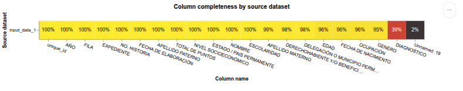
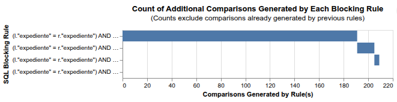

# Lentigob SPlink

En este repositorio se pueden encontrar pruebas de exploración de la biblioteca de _linkeo_ o vinculación de registros 
(_data linkeage_ ó _record linkeage_) [_SPlink_](https://github.com/moj-analytical-services/splink). Esta biblioteca es 
de código abierto y como bien lo indica la propia
documentación de la misma, ésta permite deduplicar y vinculación de registros en conjuntos de datos.

El objetivo de esta exploración es evaluar la infraestructura de la biblioteca para integrar nuevas funcionalidades 
customizadas, como por ejemplo reglas de agrupamiento y comparación, así como entender bajo que metodología la 
biblioteca lleva a cabo la vinculación de registros.

## Uso

### Organización del repositorio

- En el directorio `exploracion` se pueden encontrar los archivos `.ipynb` donde se hizo la exploración de la biblioteca usando conjuntos de datos de salud proporcionados por personal del INER*. 
- En el directorio `splink` se encuentra el fork de la biblioteca original de _SPlink_ donde se agregaron las funcionalidades customizadas.

*Por razones de privacidad y seguridad los conjuntos de datos usados en esta exploración no se agregaron a este 
repositorio. Para poder reproducir los resultados es necesario solicitar los conjuntos de datos al personal del INER.

```bash
lentigob-splink/
├── exploracion/
│   ├── pyproject.toml                               # TOML para instalación idependiente
│   ├── comorbilidad_prueba.ipynb                    # Pruebas sobre un conjunto de datos de comorbilidades de pacientes de COVID-19
│   ├── costos_pacientes_prueba.ipynb                # Pruebas sobre un conjunto de datos de costos de atención de pacientes de COVID-19
│   └── trabajo_social_prueba.ipynb                  # Pruebas sobre un conjunto de datos socioeconómicos y demográficos de pacientes de COVID-19
    └── data/                                        # Carpeta donde se depositan los conjuntos de datos (CSV). Se mantiene en la estructura para claridad de la usuaria.
└── splink/                                          # Se muestran aquí solamente los scripts de interés para customizar la biblioteca. Para la arquitectura completa, consultar la documentación de SPlink
│   ├── pyproject.toml                               # TOML original de SPlink
│   ├── README.md                                    # Documentación original de SPlink
    └── splink/
        └── internals/
            ├── blocking_rule_library.py             # Script original de reglas de agrupamiento
            ├── blocking_rule_library_custom.py      # Script customizado de reglas de agrupamiento
└── z_img                                            # Carpeta de imágenes que se muestran en el README.md
└── README.md                                        # El presente archivo y documentación de este repositorio
```

### Instalación, requerimientos y uso

Se recomienda tratar los dos directorios principales de este repostorio (`exploracion` y `splink`) como dos ambientes de 
Python distintos e instalar de manera independiente dentro de cada directorio. Para esta finalidad se conserva el `pyproject.toml`
original de SPlink en la carpeta `splink` y se incluye otro `pyproject.toml` para la carpeta `exploracion`.

**A. Para `exploracion`**

#### Requerimientos
- [Python >=3.10.0](https://www.python.org/downloads/release/python-3100/)
- [Jupyter >=1.0.0](https://jupyter.org/)
- [SPlink 4.0.16](https://github.com/moj-analytical-services/splink)
- [Pandas >=2.0.0](https://pandas.pydata.org/)
- [DuckDB >=0.10.0](https://duckdb.org/docs/current/)

#### Instalación

Como se mencionó antes, se proporciona el `pyproject.toml` para hacer una instalación de los requerimientos para correr 
los _notebooks_ de exploración de SPlink. Se puede usar la herramienta de manejo de ambientes virtuales que la usuaria
elija. Aquí se dan las instrucciones usando [`uv`](https://docs.astral.sh/uv/) para instalar los requerimientos y 
crear el ambiente virtual.

Ejecutar en una terminal dentro de la carpeta `exploración`:

1. Instalación y creación del ambiente virtual `.venv/`
```bash
uv sync
```

2. Activar el ambiente virtual
```bash
source .venv/bin/activate
```

3. Registro del ambiente virtual en el kernel local de _Jupyter_
```bash
python -m ipykernel install --user --name=splink-project --display-name "Python (splink-exploracion)"
```

4. Levantar localmente `Jupyter notebook`
```bash
jupyter notebook
```

Con este último paso se abre en una ventana del navegador el ambiente de _Jupyter_

Cada vez que se quiera volver a trabajar con los _notebooks_ de exploración es necesario abrir una terminal y ejecutar 
los pasos 2 y 4, es decir, activar el ambiente virtual de Python y levantar localmente el servidor de _Jupyter_.

Dentro de cada _notebook_ se pueden encontrar anotaciones y observaciones sobre cada módulo de SPlink en contexto con 
los conjuntos de datos usados para la exploración.

**B. Para `splink`**

Se deben de seguir las instrucciones de instalación de la propia biblioteca de _SPlink_ que se pueden encontrar en el 
apartado [_Getting Started_](https://moj-analytical-services.github.io/splink/getting_started.html) de la 
documentación en línea. Estas instrucciones se deben de ejecutar de manera separada dentro de la ruta
`/lentigo-splink/splink`. Lo anterior para poder explorar los scripts customizados de las reglas de agrupamiento y 
comparación.

## Funciones customizadas

### Reglas de agrupamiento

En _SPlink_ las reglas de agrupamiento se ejecutan como SQL contra el backend elegido, por defecto DuckDB, así que 
cualquier lógica personalizada en Python debe de traducirse en una condición SQL evaluable por el _Linker_ (ver 
subsección _Uso de SPlink_). 

Dentro de la ruta indicada en la organización del repositorio se agregó el script `blocking_rule_library_custom.py`. 
Esto se hizo de manera paralela al script de la biblioteca original de reglas de agrupamiento `blocking_rule_library.py`.
Allí se construyó primero una función base sencilla para quitar_acentos y que
normaliza el texto eliminando diacríticos y conservando el caracter de la 
ñ/Ñ antes de la normalización.

A partir de esa función base se diseñaron dos modos de integración. El primero, el modo pandas, está implementado en
`block_on_sin_acentos` y aplica la función `quitar_acentos` sobre toda la columna del _DataFrame_ de una sola vez 
(vectorizado con `.apply`, `.str.upper()` y `.str.strip()`), de manera que se crea una columna nueva ya normalizada, y 
regresa una regla de agrupamiento SQL simple que compara esa columna nueva entre los registros izquierdo y derecho 
(¸l.columna_sin_acentos = r.columna_sin_acentos`). Este método es el más rápido de los dos propuestos, pues la 
transformación ocurre una sola vez sobre todo el conjunto de datos antes de que SPlink construya los pares.

El segundo modo, la [Función Definida por la Usuaria (FDU)](https://moj-analytical-services.github.io/splink/dev_guides/udfs.html),
se define en `registrar_fdu_sin_acentos`. Aquí en lugar de transformar el _DataFrame_ de antemano, se registra 
`quitar_acentos` directamente dentro de la conexión de _DuckDB_ con `con.create_function`,
verificando primero que no exista ya una función con ese nombre para evitar conflictos. La regla de agrupamiento
resultante llama a esa función fila por fila dentro del propio SQL (`UPPER(fdu(l.columna)) = UPPER(fdu(r.columna))`). 
Este modo es más flexible porque no requiere modificar los datos antes, pero es más lenta ya que _DuckDB_ invoca a 
Python por cada fila comparada, por lo que se recomienda usarse para conjuntos pequeños.

Para no obligar a la usuaria a elegir manualmente entre importar una función u otra, se agrega
`get_regla_bloqueo_sin_acentos` como punto de entrada único. Esta función recibe la columna y un parámetro para 
seleccionar el modo ("pandas" o "fdu") y valida que se hayan pasado los argumentos necesarios para delegar a la función
correspondiente.

Se probó la integración adecuada con SPlink, que se muestra en el bloque `__main__`, donde se carga el dataset 
`INER_COVID19_Pacientes_DiagnosticoComorbilidad.csv` a manera de ejemplo (se recuerda a la usuaria que no se incluyen 
los datasets en el repositorio por temas de privacidad y seguridad y que si se requieren es necesario pedírselos al 
personal del INER). En este bloque se genera un id único `unique_id`, y se prueba cada modo por separadose. Después se 
usa la herramienta interna de SPlink para contar cuántos pares generaría la regla de agrupamiento personalizada con 
`count_comparisons_from_blocking_rules`, y se ejecuta manualmente la unión SQL para verificar que
los pares detectados sean los esperados antes de usar la regla dentro del `SettingsCreator` real de SPlink. Queda 
pendiente en siguientes pasos eliminar este bloque y agregar las funciones definidas aquí al script original de 
bibliotecas de reglas de agrupamiento.


## Anotaciones y Observaciones de _SPlink_

Como parte del proyecto y dado que _SPlink_ es una biblioteca de código abierto desarrollada por personas del Reino 
Unido, incluyo un breve resumen y anotaciones de la documentación original (en inglés) de la biblioteca. Por lo tanto lo
escrito aquí algunas veces serán un parafraseo o un _copy-paste_ traducido de la documentación original.

### Preliminares

Además de las dependencias _SPlink_ requiere lo siguiente para su uso:

- Una columna con un ID único. Por defecto, SPlink asume que esa columna se llama `unique_id`.
- Un dataset de entrada estandarizado con nombres de columnas consistentes y formato estandarizado 
(minúsculas, signos de puntuación limpios, formato de fecha estándar, etc.)
- Un dataset con múltiples columnas que no estén fuertemente correlacionadas. Por ejemplo si el tipo de _entidad_ es 
_personas_, entonces las columnas pueden ser _nombre_, _fecha de nacimiento_ y _ciudad_. O bien si la _entidad_ es 
_compañías_ entonces las columnas pueden ser _facturación_, _sector_, y _número de teléfono_.
- Una alta correlación ocurre cuando el valor de una columna puede ser fuertemente predecido por el valor de otra 
columna. Por ejemplo un campo en la columna _ciudad_ es casi perfectamente correlacionado con la columna 
_código postal_, o bien, la columna _género_ está correlacionada con la columna _nombre_.
- Los _nulos_ del dataset son "nulos verdaderos", es decir no son cadenas de caracteres vacías.

Además de lo anterior _SPlink_ acepta tres tipos de entradas

a. Un dataset único en donde se deduplicaran los registros del mismo dataset (_dedupe_only_).
b. Dos o más dataset en donde se hará la compración y deduplicación entre registros de los N datasets pero sin comparar
registros dentro de un mismo dataset (_link_only_).
c. Las dos anteriores en conjunto (_link_and_dedupe_).

En la exploración que se hace dentro de este repositorio sólo se trabajó con la opcion a.

_SPlink_ usa _DuckDBAPI como backend para poder correr _SQL_ "tras bambalinas", pero puede usar _Spark_, _Athena_ o
_SQLite_.

### Uso de _SPlink_

_SPlink_ provee de herramientas para el análisis exploratorio de datos que facilitarán la elección de reglas de 
agrupamiento en el uso de la biblioteca. Provee la generación de una gráfica de completez del conjunto de datos o bien 
una gráfica de la distribución de los valores en los datos.



_SPlink_ usa el concepto de _blocking_rule_, que en este repositorio para evitar confusiones se traducen como _reglas de
agrupamiento_. Estas reglas sirven para generar pares de registros candidatos a comparar. Según la 
[documentación el objetivo de éstas es doble](https://moj-analytical-services.github.io/splink/demos/tutorials/03_Blocking.html#devising-effective-blocking-rules-for-prediction):

1. Eliminar suficientes pares de comparación que no coincidan para que el proceso de vinculación de registros sea lo suficientemente pequeño para que pueda calcularse.

2. Eliminar la menor cantidad posible de pares que coincidan realmente (idealmente ninguno).

_SPlink_ recomienda la generación de múltiples reglas de agrupamiento para lograr ambos objetivos, por lo cual podrían ser 
entre 3 y 10 reglas de agrupamiento.

Para la elección de las reglas de agrupamiento SPlink también provee de diversas herramientas como el conteo del número 
de comparaciones creadas por una sóla regla de agrupamiento (`count_comparisons_from_blocking_rule`); el conteo de los
valores más "comunes" o repetidos dentro del dataset para evitar un posible sesgo (`n_largest_blocks`); o bien el conteo
del número de comparaciones creadas por una lista de reglas de agrupamiento (`cumulative_comparisons_to_be_scored_from_blocking_rules_chart`). 
Esta última me pareció muy útil pues te muestra una gráfica de barras comparando no acumulativamente el número de nuevas 
comparaciones por cada regla de agrupamiento.



Después de generar las comparaciones de pares de registros con las reglas de agrupamiento, el siguiente paso es estimar un 
modelo de vinculación probabilística que le asigne un puntaje a cada comparación, prediciendo si dos registros 
representan el mismo sujeto o entidad. El objetivo de estimar este modelo es aprender qué tan importante es cada parte de los 
datos para la vinculación. Por ejemplo, una coincidencia en fecha de nacimiento es un indicador mucho más fuerte de que 
dos registros son la misma persona que una coincidencia en género, mientras que una discrepancia en género puede pesar 
más en contra de la vinculación que una discrepancia en nombre, ya que los nombres suelen capturarse de forma distinta 
entre un registro y otro. Esta importancia relativa se refleja en los _match weights_ 
(pesos de coincidencia parciales), que se suman para calcular el puntaje total de coincidencia, y que se derivan de 
los parámetros `m` y `u` del modelo de [Fellegi-Sunter](https://www.robinlinacre.com/intro_to_probabilistic_linkage/) subyacente que usa SPlink para hacer la vinculación de registros. 
Estos parámetros SPlink los estima mediante distintas rutinas estadísticas.

Para estimar estos parámetros _SPlink_ usa _Comparisons_ que aquí llamaré comparaciones. Una Comparación o *Comparison* 
representa como se va a evaluar la similitud de un campo. El modelo que se construye usando 
_SPlink_ consta de muchas comparaciones.

Las comparaciones tienen niveles `ComparisonLevels` donde se asignan calificaciones de similitud entre las columnas para
cierta comparación. Por ejemplo:

```
Modelo de vinculación de datos
├─-- Comparison: fechaing
│    ├─-- ComparisonLevel: Coincidencia exacta
│    ├─-- ComparisonLevel: Un caracter de diferencia
│    ├─-- ComparisonLevel: Cualquier otra
├─-- Comparison: nombre
│    ├─-- ComparisonLevel: Coincidencia exacta
│    ├─-- ComparisonLevel: JaroWinkler > 0.9
│    ├─-- ComparisonLevel: Cualquier otra
│    etc.
```

Para poder definir las comparaciones SPlink también cuenta con herramientas auxiliares. Éstas son funciones que entran 
dentro de dos categorías, unas que son _fuzzy matching_ y otras muy específicas dependiendo del tipo de dato, por ejemplo 
para hacer los niveles de comparación de una fecha de nacimiento se puede usar `DateOfBirthComparison`.

Estas funciones se pueden customizar y agregar nuevas de la misma manera en la que se hizo con las reglas de
agrupamiento. Una vez elegidas las comparaciones y sus niveles, se puede especificar el diccionario de configuraciones 
para después pasarlo al _Linker_. 

## Conclusiones

_SPlink_ permite modificar el código fuente y no tiene una lista única de reglas de agrupamiento ni de comparación que 
al final se traducen en una condición SQL evaluable por el motor de base de datos a elegir por la usuaria. Lo anterior permite 
resolver casos particulares del idioma español, como la normalización de acentos o la ñ, que las reglas predefinidas 
no cubren. Además de poder agregar otro tipo de personalizaciones, no únicamente acerca del idioma. Esa flexibilidad 
tiene sus desventajas. La biblioteca no revisa si la lógica personalizada que se escribió
está bien construida ni si es eficiente, simplemente la ejecuta. Esto quiere decir que si una función de normalización
tiene un error o si dos funciones registradas en el motor terminan con el mismo nombre, o si una regla está mal pensada 
desde el enfoque probabilístico usado en SPlink. También de acuerdo a los dos modos definidos en la customización se 
puede sacrificar velocidad por flexibilidd o visceversa.f

Quizá sea recomendable que para personalizar _SPlink_ y seguir utilizando su código fuente de forma sostenible, 
la persona desarrolladora debe mantener las funciones personalizadas desacopladas de la lógica interna de la biblioteca  
y documentar qué modo de integración usa cada regla y por qué, verificar los resultados con
consultas SQL manuales antes de confiar en las utilidades de conteo de _SPlink_, y cuidar los conflictos de nombres al
registrar funciones en la conexión del motor, ya que estas persisten mientras la conexión esté abierta. Si además se
trabaja sobre un fork del código fuente, como en este caso, es indispensable llevar control de los cambios respecto al
repositorio original para poder actualizar la biblioteca sin perder las modificaciones propias ni romper compatibilidad,
sobre todo cuando cambian versiones de dependencias como `sqlglot`, que se menciona aquí por ser una de las dependencias
que presentaron conflictos al ejecutar el script customizado.

En base a la documentación _SPlink_ destaca por no estar atada a un sólo motor de ejecución y por ofrecer un
enfoque probabilístico fundamentado en el modelo Fellegi-Sunter en lugar de reglas puramente determinísticas, sin 
embargo hay que tomar en cuenta que hay otros enfoques que pudieran ser más modernos y que si se quieren agregar de 
manera personalizada a SPLink, tal vez no sea posible. Lo que puedo destacar es que SPlink separa claramente las etapas 
del proceso (agrupamiento, comparación, estimación de parámetros y predicción), lo que
facilita depurar cada parte por separado. Esto se puede tomar en cuenta para popder construir una infraestructura de
una biblioteca de vinculación de registros desde cero y con un enfoque probabilístico distinto. 

Como desventaja la curva de aprendizaje es bastante considerable cuando se necesita
personalización más allá de lo predefinido ya que para poder mantener la lógica y calidad de las estimaciones se necesita
conocer adecuadamente el enfoque probabilístico que usa la biblioteca. En resumen como una biblioteca independiente de 
vinculación de registros funciona bastante bien, pero customizar la misma ya requiere de un nivel de experiencia y 
dedicación mayores.


